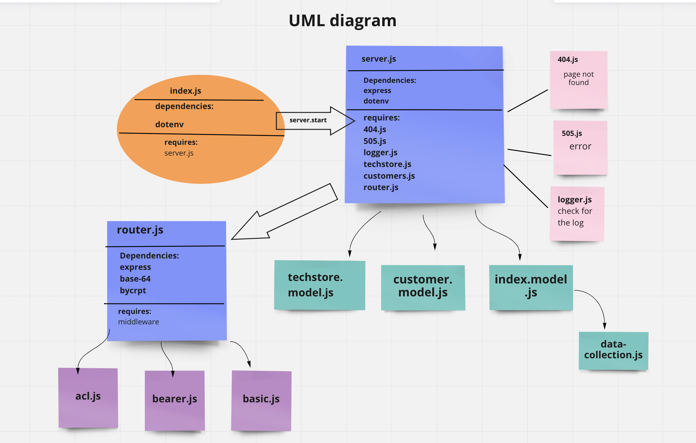
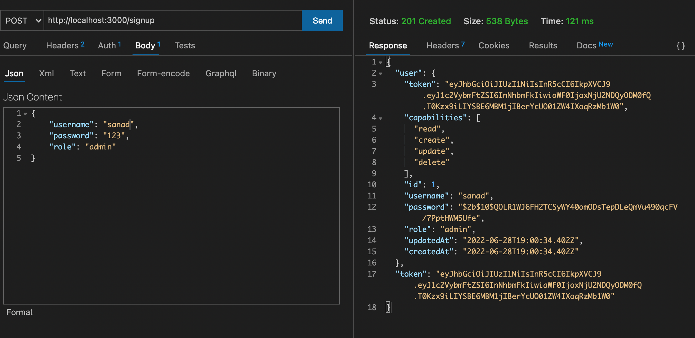
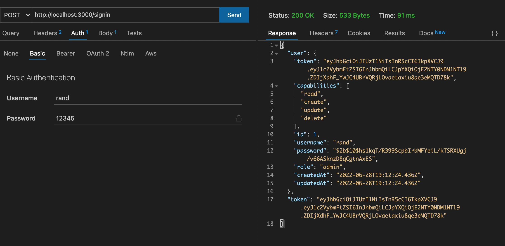
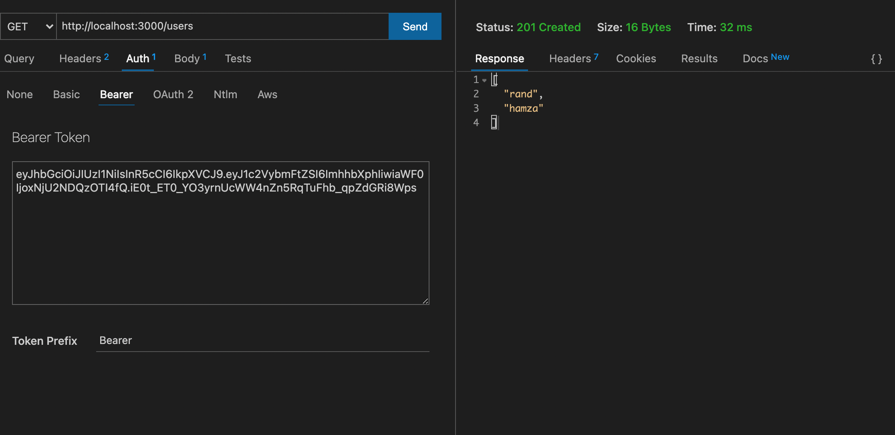
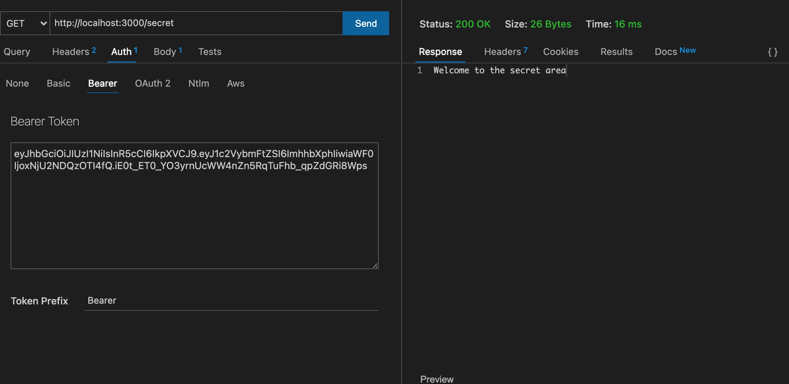

# tech Store

1-user: ['read'] from the techStore table,

2- writer: ['read', 'create'] from the techStore table,

3- editor: ['read', 'create', 'update'] from the techStore table,

4- admin: ['read', 'create', 'update', 'delete'] from the techStore table

## UML diagram

## links related to the project

[Heroku app](https://command-line-project.herokuapp.com/)

[Actions](https://github.com/backend-bestteam/command-line-project/actions)

[pull request](https://github.com/backend-bestteam/command-line-project/pull/3)

## Auth Routers

1. POST /signup to create a user

2. POST /signin to login a user and receive a token

3. GET /secret should require a valid bearer token

4. GET /users should require a valid token and “delete” permissions

